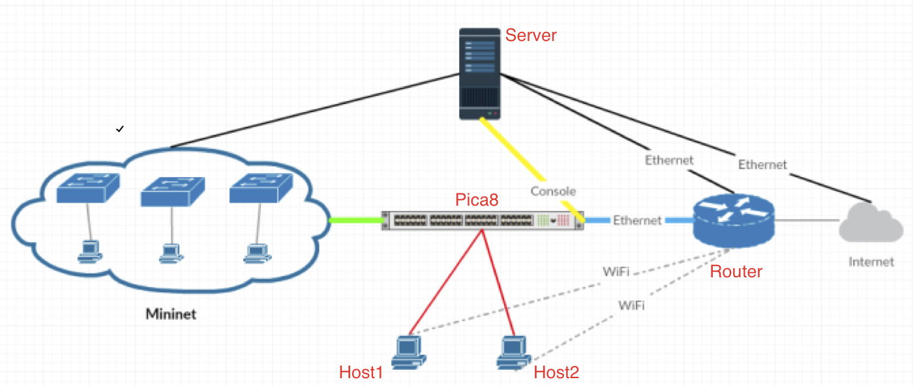

# Testbed topo:

The IP address and Mac address of devices in topo:

>`Server:192.168.33.101  00:25:90:fc:cd:dc`

>`Pica8:    192.168.33.104  48:6e:73:02:05:ad`

>`Host1:    192.168.33.110  b8:27:eb:ed:94:03`

>`Host2:    192.168.33.111  b8:27:eb:f0:4b:00`

# 1. Testbed Configuration

## ONOS Install guide:

https://wiki.onosproject.org/display/ONOS/ONOS+from+Scratch

## Pica8 Configuration

### Use screen for initialization of Pica8 via serial port when Pica8 has no IP address

> $ screen /dev/ttyS0 115200

### Install and configure Pica8:

> $ sudo picos_boot

Select the mode of pica8 as Open vSwitch mode

> $ sudo service picos start

> $ sudo reboot

## Mininet Installation

> sudo apt-get install mininet

# 2. Testbed usage

## Start ONOS

> $ ok clean

## Create vSwitch on Pica8

### Add bridge on Pica8:
A bridge means a virtual switch, br* is the bridge name you set:

> $ ovs-vsctl add-br br* 

### Add port to the bridge:
ge-1/1/* is the port number on Pica8:

> $ ovs-vsctl add-port br* ge-1/1/* -- set Interface ge-1/1/* type=pica8 

In switch mode you may not be able to connect with each other even if both devices connect to the same bridge,if you want to connect with each other without Pica8 connect to a controller, you can add a local flow rule and it will work.

Remember, te-1/1/1 represents 10G ports, while ge-1/1/1 represents 1G ports.

Add flow rule:

In this case we add a pair of bidirectional rules to allow connections between port1 and port2:

> $ ovs-ofctl add-flow br* in_port=1,actions=output:2

> $ ovs-ofctl add-flow br* in_port=2,actions=output:1

### Dump port and check rx tx:

> $ ovs-ofctl dump-ports br0

### Dump flow:

> $ ovs-ofctl dump-flows br0

### Set controller:
The connection from bridge to SDN controller will start automatically after this command:

> $ ovs-vsctl set-controller br* tcp:IP_address:6633

### Set OpenFlow protocol version:

> $ ovs-vsctl set Bridge br* protocols=OpenFlow14

### Check connection:

> $ netstat -an | grep 6633

Connection is successful if the connection of port 6633 shows established. Otherwise the connection is failed.

## Mininet Configuration

In order to connect Mininet with Pica8, we need to assign a physical ethernet port to Mininet switch. The example Mininet topo file are shown in [testbed.py](./example/testbed.py). 

For more mininet example, you can visit https://github.com/mininet/mininet/tree/master/examples. In `hwintf.py`, it shows how to add an interface (for example a real hardware interface) to a network after the network is created.

# 3. Troubleshooting

## Cannot establish connection between Pica8 and ONOS

Check the firewall rule with root permission

> $ sudo UFW status 

> $ sudo UFW allow <port>

> $ sudo UFW deny <port>

## Cannot establish connection between Pica9 and Mininet

Make sure you are running Mininet version 2.2.1 or later:

> $ mn --version

If not, try installing from the git repository https://github.com/mininet/mininet.git.

And make sure that Mininet works:

> $ sudo mn --test pingall

## Raspberry Pi cannot connect to internet

Shutdown eth0 before connect to internet

> $ sudo ifdown eth0

After connect to internet, enable eth0

> $ sudo ifup eth0
